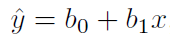
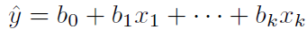

# Linear Regression from Scratch
Tugas Seleksi Ca-IRK 2018

Membuat algoritma linear regression dari 0.

## Deskripsi Masalah
Seperti yang telah kalian pelajari pada mata kuliah Probabilitas dan Statistika, terdapat suatu algoritma yang bernama <b>Regresi Linier (Linear Regression)</b>. Buatlah algoritma Regresi Linear versi kalian sendiri dan cobalah memakai algoritma tersebut untuk memproses dataset!

## Identitas Pembuat
- Nama    : Michael Hans
- NIM     : 13518056

## Dasar Teori Regresi Linier
Regresi Linier merupakan suatu metode pendekatan untuk menggambarkan hubungan antara variabel terikat y dengan satu atau lebih variabel bebas x. Tujuan dari Regresi Linier adalah untuk memprediksi nilai variabel terikat berdasarkan data-data yang telah diperoleh sebelumnya. Secara umum, jenis regresi linier terbagi menjadi dua, yaitu:
- <b>Regresi Linier Sederhana (Simple Linear Regression)</b>
  Regresi ini hanya melibatkan tepat dua variabel, yaitu sebuah variabel terikat y dan sebuah variabel bebas x. Persamaan umum untuk regresi linier sederhana adalah sebagai berikut.
  

    

- <b>Regresi Linier Berganda (Multiple Linear Regression)</b>
  Regresi ini bisa melibatkan lebih dari dua variabel, yaitu sebuah variabel terikat y dan satu atau lebih variabel bebas x. Persamaan umum untuk regresi linier berganda adalah sebagai berikut.
  

    

Jika variabel terikat lebih dari satu (y1, y2, ..., yN) dengan variabel bebas berupa (x1, x2, ..., xN), maka dilakukan sebanyak N regresi untuk setiap y yang terdefinisi. Setiap y akan diregresikan dengan kumpulan variabel bebas yang telah ditetapkan.

## Seputar Kode Sumber
Algoritma Regresi Linier dibuat dalam bahasa pemrograman Julia. Mengingat bahasa pemrograman Julia bukan bahasa berparadigma objek, maka untuk mewakili setiap class / object tertentu, digunakan Abstract Data Type (ADT) yang merupakan tipe bentukan yang terdiri atas atribut-atribut tertentu.

Kode sumber terdiri atas 4 bagian, yaitu:
1. Data Loader and Splitting 
   Modul ini bertanggung jawab dalam pemrosesan pembacaan data, pemisahan data (splitting), dan pemilahan kolom untuk menjadi variabel bebas dan variabel terikat. Library yang digunakan dalam modul ini adalah DataFrames dan CSV. Kode sumber untuk modul ini dapat diakses pada `./src/loader.jl`

2. Linear Regression 
   Modul ini bertanggung jawab dalam pembuatan garis regresi linear berdasarkan masukkan data-data variabel bebas dan variabel terikat. Perhitungan setiap koefisien dalam regresi linear (b0, b1, ..., bN) diselesaikan dengan memanfaatkan sistem persamaan linear (SPL) multi-variabel. Agar SPL dapat diselesaikan dalam waktu yang cepat, maka digunakan metode Gauss-Jordan sebagai algoritma dalam menemukan solusi-solusi SPL yang berupa koefisien regresi linear tersebut. Kode sumber untuk modul ini dapat diakses pada `./src/regression.jl`

3. Visualizer 
   Modul ini bertanggung jawab dalam memvisualisasikan titik-titik data Test dan garis regresi linier yang dihasilkan (plotting). Modul ini cukup memanfaatkan library Plots untuk proses plotting data. Kode sumber untuk modul ini dapat diakses pada `./src/visualizer.jl`

4. Main Program 
   Bagian ini dibuat dalam kakas Jupyter Notebook sebagai salah satu syarat *main program* yang diperlukan. Instruksi dan langkah-langkah main program lebih lanjut dijelaskan pada notebook tersebut. File `.ipynb` notebook tersebut dapat diakses pada `./src/main.ipynb` dengan menggunakan aplikasi Jupyter Notebook.

## Library yang Diperlukan
- Plots (untuk melakukan plotting)
- DataFrames (untuk pengolahan dataframe)
- CSV (untuk pembacaan CSV)

## Checklist Pengerjaan
- [X] Algoritma Linear Regression
- [X] Splitting Dataset
- [X] Visualisasi Regresi
- [X] Bahasa Pemrograman Julia

## Referensi
- Vehicle Dataset from Cardekho: https://www.kaggle.com/nehalbirla/vehicle-dataset-from-cardekho.
- Julia Documentation: https://docs.julialang.org/
- Julia Cheatsheet: https://cheatsheets.quantecon.org/julia-cheatsheet.html
- Add Julia to Jupyter: https://datatofish.com/add-julia-to-jupyter/
- Julia Plots Tutorial: https://docs.juliaplots.org/latest/tutorial/
- Gauss-Jordan Elimination: https://www.geeksforgeeks.org/program-for-gauss-jordan-elimination-method/

## Author
**13518056 - Michael Hans** - *Designer, Programmer, and Tester*

## Acknowledgements
* Asisten IRK, Leonardo Wijaya
